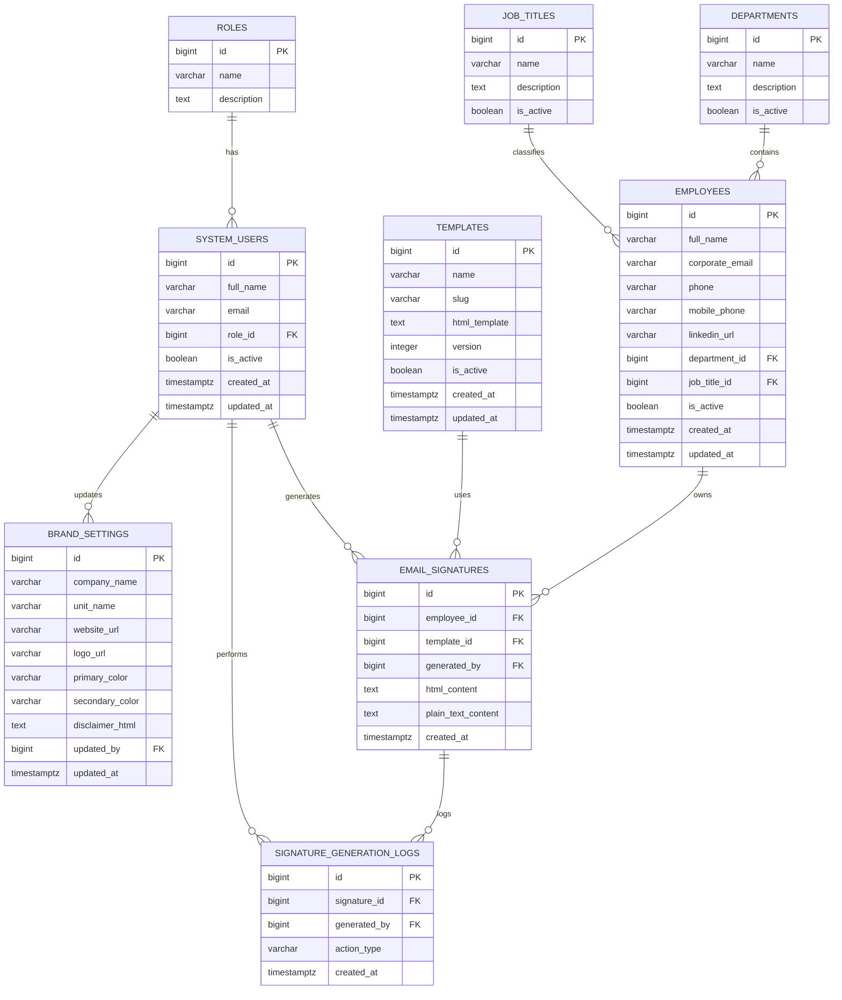

```mermaid
erDiagram
ROLES {
bigint id PK
varchar name
text description
}

SYSTEM_USERS {
bigint id PK
varchar full_name
varchar email
bigint role_id FK
boolean is_active
timestamptz created_at
timestamptz updated_at
}

DEPARTMENTS {
bigint id PK
varchar name
text description
boolean is_active
}

JOB_TITLES {
bigint id PK
varchar name
text description
boolean is_active
}

EMPLOYEES {
bigint id PK
varchar full_name
varchar corporate_email
varchar phone
varchar mobile_phone
varchar linkedin_url
bigint department_id FK
bigint job_title_id FK
boolean is_active
timestamptz created_at
timestamptz updated_at
}

TEMPLATES {
bigint id PK
varchar name
varchar slug
text html_template
integer version
boolean is_active
timestamptz created_at
timestamptz updated_at
}

BRAND_SETTINGS {
bigint id PK
varchar company_name
varchar unit_name
varchar website_url
varchar logo_url
varchar primary_color
varchar secondary_color
text disclaimer_html
bigint updated_by FK
timestamptz updated_at
}

EMAIL_SIGNATURES {
bigint id PK
bigint employee_id FK
bigint template_id FK
bigint generated_by FK
text html_content
text plain_text_content
timestamptz created_at
}

SIGNATURE_GENERATION_LOGS {
bigint id PK
bigint signature_id FK
bigint generated_by FK
varchar action_type
timestamptz created_at
}

ROLES ||--o{ SYSTEM_USERS : has
DEPARTMENTS ||--o{ EMPLOYEES : contains
JOB_TITLES ||--o{ EMPLOYEES : classifies
SYSTEM_USERS ||--o{ BRAND_SETTINGS : updates
EMPLOYEES ||--o{ EMAIL_SIGNATURES : owns
TEMPLATES ||--o{ EMAIL_SIGNATURES : uses
SYSTEM_USERS ||--o{ EMAIL_SIGNATURES : generates
EMAIL_SIGNATURES ||--o{ SIGNATURE_GENERATION_LOGS : logs
SYSTEM_USERS ||--o{ SIGNATURE_GENERATION_LOGS : performs
```
